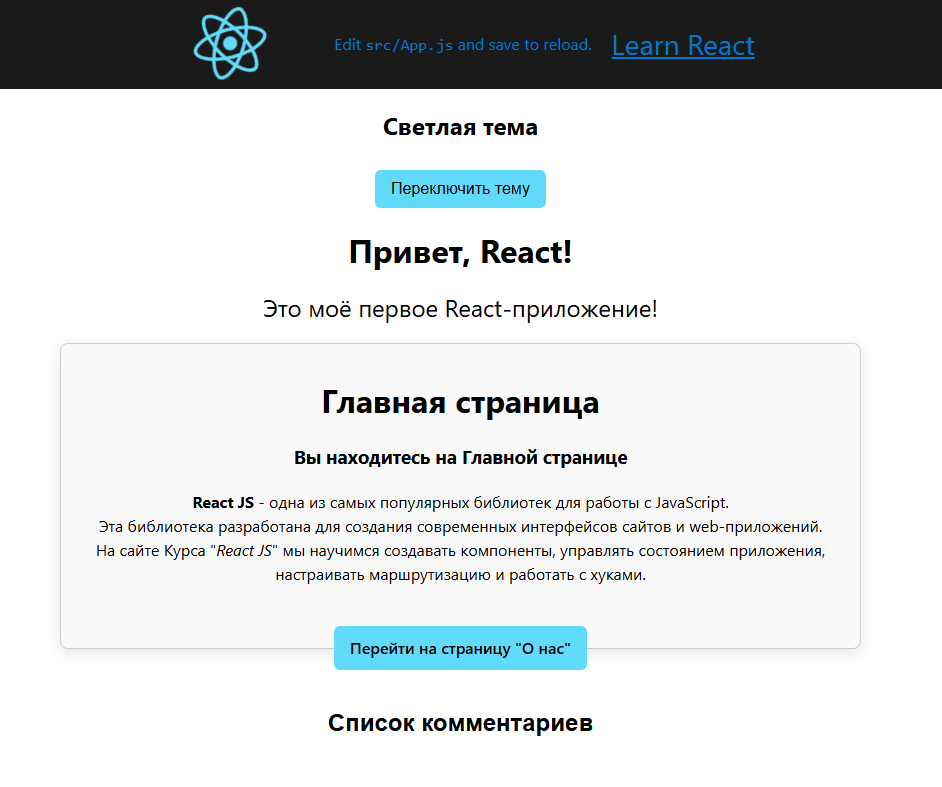
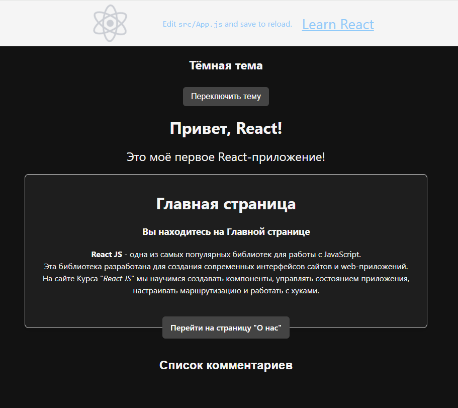

## Проект work-5v2
### Команды для запуска:

Для доступа в проект выполнить команды:
```bash
  cd lesson-5/work-5v2/my-first-react-app
```
```bash
  npm start
```

### < - [Назад](../README.md)  

<br><br>
#### Светлая тема Приложения




<br><br>
#### Темная тема Приложения



<br><br><br><br>