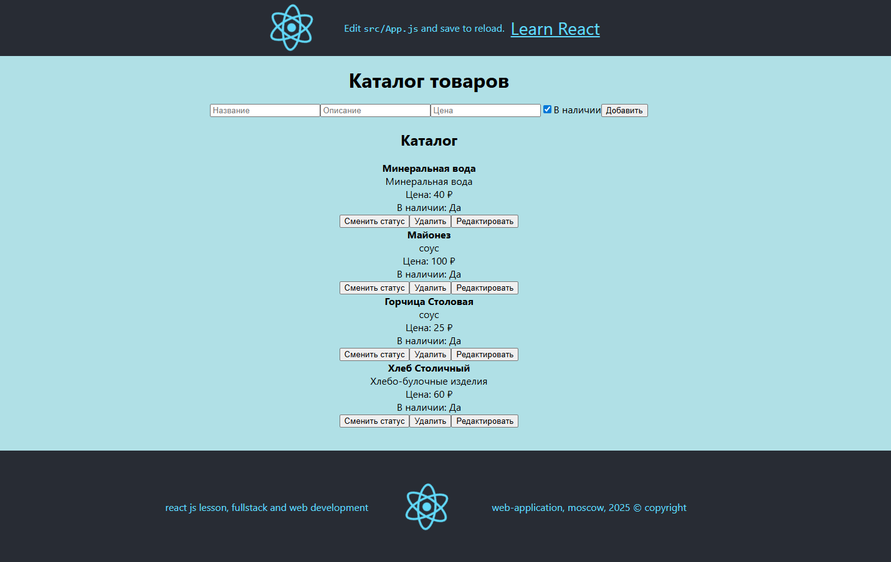

# Фреймворк React JS. Обучение: Факультатив
## Урок 11,12. Погружение в Redux. Connect
### - > [Переход в Корневой каталог](../README.md)
### Домашнее задание

Разработать приложение для управления каталогом продуктов, позволяющее <br> 
добавлять, удалять, отображать и редактировать продукты.

#### Настройка Redux Store:

Использовать configureStore из @reduxjs/toolkit для создания хранилища. <br>
Определить начальное состояние и создать слайс с использованием createSlice для продуктов.  <br>
Каждый продукт должен иметь id, name, description, price, и available. <br>

В слайсе определить редьюсеры и действия для добавления нового продукта, удаления продукта по ID,  <br> 
обновления продукта и изменения его доступности. <br>


#### Компоненты React:

Компонент для добавления продукта:
Создайте форму, позволяющую пользователям вводить данные нового продукта <br>
(имя, описание, цена, доступность) и добавлять его в каталог. <br>

Компонент для отображения продуктов:
Разработайте компонент, который отображает список всех продуктов с их атрибутами, <br>
а также кнопки для удаления продукта из каталога и переключения его доступности. <br>

Компонент для редактирования продукта: <br>
Опционально, предоставьте возможность редактирования существующих продуктов, <br> 
чтобы можно было изменять их имя, описание, цену и доступность. <br>

### Решение задания
##
## Цель задания

Создать приложение на React + Redux Toolkit для управления каталогом продуктов. <br>
Пользователь сможет:

- добавлять товары,
- просматривать их список,
- редактировать,
- удалять,
- переключать доступность (в наличии / нет в наличии).

##
## Зависимости уже установленные в проекте

Эти версии уже стабильно работают для выполнения заданий имеющихся в данном проекте:
```bash
react@18.2.0  
react-dom@18.2.0  
react-router-dom@6.21.1  
@mui/material@5.14.18  
@mui/icons-material@5.14.18  
@emotion/react@11.11.1  
@emotion/styled@11.11.0
redux@4.2.1 
react-redux@8.1.3
```

##
### Команды для запуска:

Для доступа в проект выполнить команды:
```bash
  cd lesson-6/work-6/my-first-react-app
```
```bash
  npm start
```

##
## 1. Установка и настройка
### 1.1. Инициализация проекта

```bash
  npx create-react-app product-catalog
```
После создания подпроекта product-catalog, перейти в папку `product-catalog`:
```bash
  cd product-catalog
```
В папке `product-catalog` запустить проект командой:
```bash
  npm start
```
Новый проект откроется в адресе localhost http://localhost:3001/

### Установка зависимостей

Учитывая, что в проекте уже используется redux@4.2.1 и react-redux@8.1.3, требуется добавить поддержку Redux Toolkit.

Для доступа в новый проект выполнить команду:
```bash
  cd lesson-6/work-6/my-first-react-app/product-catalog
```
Установить зависимость:
```bash
  npm install react-redux@latest
```

И обновить @reduxjs/toolkit до последней версии, поддерживающей React 19:
```bash
  npm install @reduxjs/toolkit@latest
````

После установки проверить в package.json, должно быть, например:
```
    "@reduxjs/toolkit": "^2.8.2",
```
Если запись зависимости не обнаружена, выполнить команду установки только недостающей зависимости:

```bash
  npm install @reduxjs/toolkit
```

**Примечание**: при повторной установке без указания версии может подтянуться несовместимая версия или произойти перезапись package-lock.json
Потому следует использовать только правильные, совместимые версии зависимостей, чтобы не нарушить текущую согласованность версий.


### В новом проекте product-catalog
### 1.2. Создание хранилища (Redux Store)

#### Создать директорию `src/app/`
Внутри `src/app/` разместить файл `store.js`
#### `src/app/store.js`

```
import { configureStore } from '@reduxjs/toolkit';
import productsReducer from '../features/products/productsSlice';

export const store = configureStore({
  reducer: {
    products: productsReducer,
  },
});
```

#### `src/index.js`

```
import React from 'react';
import ReactDOM from 'react-dom/client';
import App from './App';
import { Provider } from 'react-redux';
import { store } from './app/store';

const root = ReactDOM.createRoot(document.getElementById('root'));
root.render(
  <Provider store={store}>
    <App />
  </Provider>
);
```

##
## 2. Слайс для управления продуктами
#### `src/features/products/productsSlice.js`

```
import { createSlice, nanoid } from '@reduxjs/toolkit';

const initialState = [
  {
    id: nanoid(),
    name: 'Товар A',
    description: 'Описание A',
    price: 100,
    available: true,
  },
];

const productsSlice = createSlice({
  name: 'products',
  initialState,
  reducers: {
    addProduct: {
      reducer(state, action) {
        state.push(action.payload);
      },
      prepare(product) {
        return { payload: { ...product, id: nanoid() } };
      },
    },
    deleteProduct(state, action) {
      return state.filter(product => product.id !== action.payload);
    },
    toggleAvailability(state, action) {
      const product = state.find(p => p.id === action.payload);
      if (product) product.available = !product.available;
    },
    updateProduct(state, action) {
      const index = state.findIndex(p => p.id === action.payload.id);
      if (index !== -1) {
        state[index] = action.payload;
      }
    },
  },
});

export const { addProduct, deleteProduct, toggleAvailability, updateProduct } = productsSlice.actions;
export default productsSlice.reducer;
```

##
## 3. Компоненты React
### 3.1. Компонент добавления продукта
#### `src/components/AddProductForm.jsx`

```
import { useState } from 'react';
import { useDispatch } from 'react-redux';
import { addProduct } from '../features/products/productsSlice';

export default function AddProductForm() {
  const dispatch = useDispatch();
  const [form, setForm] = useState({ name: '', description: '', price: '', available: true });

  const handleChange = (e) => {
    const { name, value, type, checked } = e.target;
    setForm(prev => ({ ...prev, [name]: type === 'checkbox' ? checked : value }));
  };

  const handleSubmit = (e) => {
    e.preventDefault();
    dispatch(addProduct({ ...form, price: parseFloat(form.price) }));
    setForm({ name: '', description: '', price: '', available: true });
  };

  return (
    <form onSubmit={handleSubmit}>
      <input name="name" placeholder="Название" value={form.name} onChange={handleChange} />
      <input name="description" placeholder="Описание" value={form.description} onChange={handleChange} />
      <input name="price" type="number" placeholder="Цена" value={form.price} onChange={handleChange} />
      <label>
        <input type="checkbox" name="available" checked={form.available} onChange={handleChange} />
        В наличии
      </label>
      <button type="submit">Добавить</button>
    </form>
  );
}
```

##
### 3.2. Компонент отображения продуктов
#### `src/components/ProductList.jsx`

```
import { useSelector, useDispatch } from 'react-redux';
import { deleteProduct, toggleAvailability } from '../features/products/productsSlice';

export default function ProductList() {
  const products = useSelector(state => state.products);
  const dispatch = useDispatch();

  return (
    <div>
      <h2>Каталог</h2>
      {products.map(product => (
        <div key={product.id}>
          <p><strong>{product.name}</strong></p>
          <p>{product.description}</p>
          <p>Цена: {product.price} ₽</p>
          <p>В наличии: {product.available ? 'Да' : 'Нет'}</p>
          <button onClick={() => dispatch(toggleAvailability(product.id))}>Сменить статус</button>
          <button onClick={() => dispatch(deleteProduct(product.id))}>Удалить</button>
        </div>
      ))}
    </div>
  );
}
```

##
### 3.3. Компонент редактирования продукта (опционально)
#### `src/components/EditProductForm.jsx`

```
import { useDispatch } from 'react-redux';
import { updateProduct } from '../features/products/productsSlice';

export default function EditProductForm({ product, onClose }) {
  const [form, setForm] = useState({ ...product });
  const dispatch = useDispatch();

  const handleChange = (e) => {
    const { name, value, type, checked } = e.target;
    setForm(prev => ({ ...prev, [name]: type === 'checkbox' ? checked : value }));
  };

  const handleSubmit = (e) => {
    e.preventDefault();
    dispatch(updateProduct({ ...form, price: parseFloat(form.price) }));
    onClose();
  };

  return (
    <form onSubmit={handleSubmit}>
      <input name="name" value={form.name} onChange={handleChange} />
      <input name="description" value={form.description} onChange={handleChange} />
      <input name="price" type="number" value={form.price} onChange={handleChange} />
      <label>
        <input type="checkbox" name="available" checked={form.available} onChange={handleChange} />
        В наличии
      </label>
      <button type="submit">Сохранить</button>
    </form>
  );
}
```

##
## 4. Итоговый `App.js`

```
import AddProductForm from './components/AddProductForm';
import ProductList from './components/ProductList';

function App() {
  return (
    <div>
      <h1>Каталог товаров</h1>
      <AddProductForm />
      <ProductList />
    </div>
  );
}

export default App;
```

##
## Результат (в таблице)

| Функционал            | Реализовано |
|-----------------------|-------------|
| Добавление продукта   | +           |
| Удаление продукта     | +           |
| Отображение списка    | +           |
| Переключение наличия  | +           |
| Редактирование товара | +           |

## Страница Каталога (product-catalog)



##
### Принудительная остановка процесса на портах 3000, 3001, если консоль уже закрыта

- Для Windows (PowerShell) выполнить команду:
  -  для остановки порта 3000:

    ```bash
      Get-NetTCPConnection -LocalPort 3000 -State Listen | ForEach-Object {
        Stop-Process -Id $_.OwningProcess -Force
    }
    
    ```
    -  для остановки порта 3001:
    ```bash
      Get-NetTCPConnection -LocalPort 3001 -State Listen | ForEach-Object {
        Stop-Process -Id $_.OwningProcess -Force
    }
    
    ```

<br><br><br><br>
### - > [Переход в Корневой каталог](../README.md)
<hr><hr><hr><hr>


<hr><hr><hr><hr>


