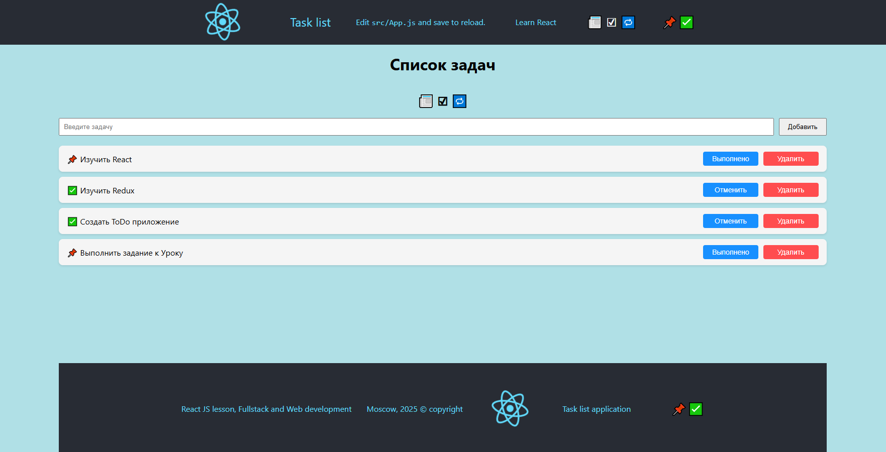

# Фреймворк React JS. Обучение: Факультатив
## Урок 13,14. Redux middlewares. Redux persist
### - > [Переход в Корневой каталог](../README.md)
### Домашнее задание

#### Имитация асинхронной загрузки и отображения списка задач из локального хранилища.

1. Инициализация проекта и установка зависимостей: Инициализируйте новый проект React . Установите @reduxjs/toolkit и react-redux.

2. Создание локальных данных: Определите массив объектов, представляющих задачи, в файле, например, src/data/tasks.js. Каждая задача может содержать поля, такие как id, title и completed.

3. Настройка Redux store: Создайте Redux store с использованием configureStore из @reduxjs/toolkit. Используйте Redux Thunk middleware, уже включённый в @reduxjs/toolkit.

4. Создание асинхронного действия с использованием Thunk:** Используйте createAsyncThunk для создания асинхронного действия, которое "загружает" данные задач из локального файла. Хотя данные и локальные, имитируйте асинхронное поведение, например, с использованием setTimeout.

5. Работа с компонентом: Используйте хуки useDispatch и useSelector в компоненте для диспетчеризации асинхронного действия и выборки списка задач из состояния. Выведите список задач.


### Решение задания
##
## Цель задания

Создать приложение, в котором список задач загружается имитацией асинхронного запроса из
локального файла с помощью `createAsyncThunk` и Redux Toolkit. Задачи отображаются в списке.

### Команды для запуска:

Для доступа в проект выполнить команды:
```bash
  cd lesson-7/work-7/async-task-list
```
```bash
  npm start
```

##
## 1. Инициализация проекта

Для работы над новым проектом перейти в папку 'lesson-7/work-7/', выполнив команду:
```bash
  cd lesson-7/work-7/
```
Далее создать проект с помощью команды:
```bash
  npx create-react-app async-task-list
```
Перейти в папку с новым проектом:
```bash
  cd async-task-list
```
Установить зависимости:
```bash
  npm install @reduxjs/toolkit react-redux
```
Если есть в корневой папке проекта, удалить папку .git
```bash
  Remove-Item -Path .git
```

##
## 2. Создание локальных данных

Создать файл `src/data/tasks.js` и определить там массив задач:

```
// src/data/tasks.js
export const mockTasks = [
  { id: 1, title: "Изучить React", completed: false },
  { id: 2, title: "Изучить Redux", completed: true },
  { id: 3, title: "Создать ToDo приложение", completed: false }
];
```

##
## 3. Настройка Redux Store
### `src/app/store.js`

```
import { configureStore } from '@reduxjs/toolkit';
import tasksReducer from '../features/tasks/tasksSlice';

export const store = configureStore({
  reducer: {
    tasks: tasksReducer,
  },
});
```

### `src/index.js`

```
import React from 'react';
import ReactDOM from 'react-dom/client';
import App from './App';
import { Provider } from 'react-redux';
import { store } from './app/store';

const root = ReactDOM.createRoot(document.getElementById('root'));
root.render(
  <Provider store={store}>
    <App />
  </Provider>
);
```

##
## 4. Создание слайса с асинхронным действием

### `src/features/tasks/tasksSlice.js`

```
import { createSlice, createAsyncThunk } from '@reduxjs/toolkit';
import { mockTasks } from '../../data/tasks';

export const fetchTasks = createAsyncThunk('tasks/fetchTasks', async () => {
  return new Promise((resolve) => {
    setTimeout(() => {
      resolve(mockTasks);
    }, 1000); // имитация задержки
  });
});

const tasksSlice = createSlice({
  name: 'tasks',
  initialState: {
    items: [],
    status: 'idle', // 'idle' | 'loading' | 'succeeded' | 'failed'
    error: null,
  },
  reducers: {},
  extraReducers(builder) {
    builder
      .addCase(fetchTasks.pending, (state) => {
        state.status = 'loading';
      })
      .addCase(fetchTasks.fulfilled, (state, action) => {
        state.status = 'succeeded';
        state.items = action.payload;
      })
      .addCase(fetchTasks.rejected, (state, action) => {
        state.status = 'failed';
        state.error = action.error.message;
      });
  },
});

export default tasksSlice.reducer;
```

##
## 5. Работа с компонентом
### `src/App.js`

```
import { useEffect } from 'react';
import { useSelector, useDispatch } from 'react-redux';
import { fetchTasks } from './features/tasks/tasksSlice';

function App() {
  const dispatch = useDispatch();
  const tasks = useSelector((state) => state.tasks.items);
  const status = useSelector((state) => state.tasks.status);

  useEffect(() => {
    if (status === 'idle') {
      dispatch(fetchTasks());
    }
  }, [dispatch, status]);

  return (
    <div>
      <h1>Список задач</h1>
      {status === 'loading' && <p>Загрузка...</p>}
      {status === 'failed' && <p>Ошибка загрузки</p>}
      {status === 'succeeded' && (
        <ul>
          {tasks.map(task => (
            <li key={task.id}>
              {task.title} {task.completed ? '✅' : '❌'}
            </li>
          ))}
        </ul>
      )}
    </div>
  );
}

export default App;
```

##
## 6. Результат (в таблице)

| Возможность                            | Реализовано |
|----------------------------------------|-------------|
| Хранение задач в Redux                 | +           |
| Асинхронная загрузка через `Thunk`     | +           |
| Вывод статуса загрузки (loading/error) | +           |
| Имитация API-запроса через setTimeout  | +           |

##
## 7. Добавление в 'tasksSlice.js' функции работы с задачами в списке

Добавить экспорт методов для задачи:
```
export const { addTask, deleteTask } = tasksSlice.actions;
```
```
    export const fetchTasks = createAsyncThunk('tasks/fetchTasks', async () => {
    return new Promise((resolve) => {
        setTimeout(() => {
            resolve(mockTasks);
        }, 1000);
    });
});

```
Добавь в reducers файла методы добавления и удаления задачи:
```
reducers: {
    addTask: (state, action) => {
        state.items.push(action.payload);
    },
    deleteTask: (state, action) => {
        state.items = state.items.filter(task => task.id !== action.payload);
    }
},

```

##
## 8. Добавить функционал в App.js

Добавить импорт useState, addTask, deleteTask, где:
- useState - требуется создать локальное состояние для поля ввода новой задачи.
- addTask, deleteTask - это Redux-экшены, которые позволяют изменять список задач.
```
import { useEffect, useState } from 'react'; // добавлен useState
import { useSelector, useDispatch } from 'react-redux';
import { fetchTasks, addTask, deleteTask } from './features/tasks/tasksSlice';
```
Чтобы можно было ввести текст новой задачи, нажать кнопку для её добавления в список, <br>
добавить в JSX соответствующую разметку и обработчик событий на кнопку:
```
<div style={{ display: 'flex', gap: '10px', marginBottom: '20px' }}>
  <input
    type="text"
    value={newTaskTitle}
    onChange={(e) => setNewTaskTitle(e.target.value)}
    placeholder="Введите задачу"
    style={{ flexGrow: 1, padding: '8px' }}
  />
  <button onClick={handleAddTask} style={{ padding: '8px 16px' }}>Добавить</button>
</div>
```

Добавить логику обработчика:
```
const [newTaskTitle, setNewTaskTitle] = useState('');

const handleAddTask = () => {
  const trimmedTitle = newTaskTitle.trim();
  if (trimmedTitle) {
    dispatch(addTask({
      id: Date.now(),
      title: trimmedTitle,
      completed: false
    }));
    setNewTaskTitle('');
  }
};
```

Чтобы можно было удалить любую задачу из списка, разместить кнопку "Удалить" рядом с каждой задачей в `map(task => …)`:
```
{tasks.map(task => (
  <li key={task.id}>
    <span>{task.title} {task.completed ? '✅' : '📌'}</span>
    <button onClick={() => handleDeleteTask(task.id)} style={{ marginLeft: '10px' }}>
      Удалить
    </button>
  </li>
))}

```
Добавить логику обработчика:
```
const handleDeleteTask = (id) => {
  dispatch(deleteTask(id));
};

```

##
## 9. Добавить стили для кнопок в App.css:

```
.tasks-list button {
  background-color: #ff4d4f;
  color: white;
  border: none;
  padding: 6px 12px;
  border-radius: 4px;
  cursor: pointer;
  font-size: 14px;
}

.tasks-list button:hover {
  background-color: #d9363e;
}

```
##
### Скриншот страницы "Список задач"



##
### Принудительная остановка процесса на портах 3000, 3001, если консоль уже закрыта

- Для Windows (PowerShell) выполнить команду:
    -  для остановки порта 3000:

    ```bash
      Get-NetTCPConnection -LocalPort 3000 -State Listen | ForEach-Object {
        Stop-Process -Id $_.OwningProcess -Force
    }
    
    ```
  
##
### - > [Переход в Обновленный Проект 'my-first-react-app'](./work-7/my-first-react-app/README.md)

<br><br><br><br>
### - > [Переход в Корневой каталог](../README.md)
<hr><hr><hr><hr>


<hr><hr><hr><hr>