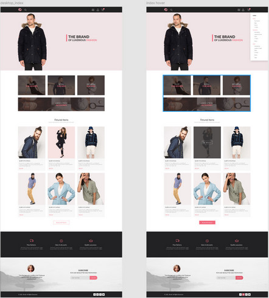
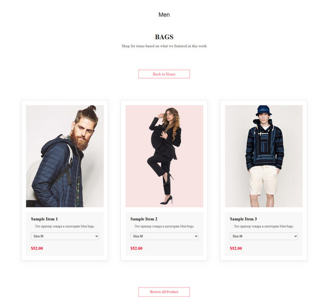
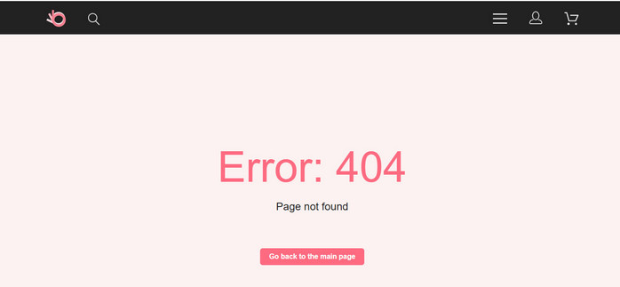
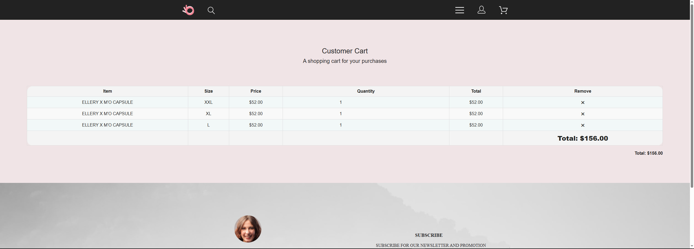

# Фреймворк React JS. Обучение: Факультатив
## Урок 15,16. Работа с API
### - > [Переход в Корневой каталог](../README.md)
### Домашнее задание

В финальном проекте вам необходимо применить все знания, которые вы получили на протяжении всего курса.

Для выполнения задания вам потребуется вёрстка сайта Интернет-магазина из курсов по HTML/CSS:
[figma.com / file](https://www.figma.com/file/SbfOi2i4S1pIs0G6uOLPCx/shop-(Copy)?type=design&node-id=0-1&mode=design&t=HqHf7Yort2ND3o3y-0)

Так как у вас уже есть готовая вёрстка, вам необходимо перевести проект на react. <br><br>


#### Функционал который необходим:

1. Все товары являются компонентами.

2. Разбить сайт на необходимые компоненты, чтобы исключить дублирование кода и чтобы можно было легче редактировать проект.

3. На странице каталога есть сортировка по размеру (S, XS, L, M) необходимо реализовать данный функционал, <br> 
   к какому именно размеру будет относиться тот или иной товар, не имеет значения.

4. Реализовать переключение между страницами с помощью Routing.

5. На странице корзины реализовать верный подсчет общей цены товаров (GRAND TOTAL \$900). <br>
   И реализовать возможность менять количество товара, это также должно влиять на цену товар (GRAND TOTAL $900).

##
### Решение задания
## Перевод HTML-шаблона интернет-магазина в React-приложение
### Цель задания

На основе курса и предоставленной вёрстки (`new-brand.zip`), реализовать одностраничное приложение интернет-магазина на React с поддержкой:

* компонентов,
* маршрутизации,
* сортировки товаров,
* управления корзиной,
* стилизации по макету.

##
### Команды для запуска приложения

Для доступа в проект выполнить команды:
```bash
  cd lesson-8/work-8/new-brand-react-app
```
```bash
  npm start
```

### Команда для остановки приложения
- Для остановки работы приложения React, в консоли работающего приложения нажать комбинацию клавиш 
```
  "CTRl" + "C"
```

### Принудительная остановка процесса на порту 3000

- Для Windows (PowerShell) для остановки порта 3000, если консоль уже закрыта, выполнить команду:

    ```bash
      Get-NetTCPConnection -LocalPort 3000 -State Listen | ForEach-Object {
        Stop-Process -Id $_.OwningProcess -Force
    }    
    ```
##
## 1. Инициализация проекта

Для работы над новым проектом перейти в папку 'lesson-8/work-8/', выполнив команду:
```bash
  cd lesson-8/work-8/
```
Далее создать проект с помощью команды:
```bash
  npx create-react-app new-brand-react-app
```
Перейти в папку с новым проектом:
```bash
  cd new-brand-react-app
```

##
<h3 id="dependencies">1.1 Зависимости, используемые в проекте</h3>

Установить зависимости:
- [react-router-dom](#react-router-dom)
```bash
    npm install react-router-dom
```
- [@reduxjs/toolkit](#toolkit) и [react-redux](#react-redux)
```bash
    npm install @reduxjs/toolkit react-redux
```
- [redux-persist](#redux-persist)
```bash
    npm install redux-persist
```
- [redux-thunk](#redux-thunk)
```bash
    npm install redux-thunk
```

##
## 2. Реализация проекта
### 2.1. Роутинг и навигация

- Настроен `react-router-dom`:

  - `/` - главная
  - `/men/:category` - категории
  - `/product/:id` - карточка товара
  - `/cart` - корзина
  - `*` -`NotFoundPage` для несуществующих маршрутов

##
### 2.2. Структура проекта

- Созданы следующие директории в проекте, в папке src/:
  - components/ -  Переиспользуемые компоненты: Header, Footer, ProductCard и др.
  - pages/   -  Страницы: CatalogPage, ProductPage, CartPage, NotFoundPage
  - redux/   -  Redux store, cartSlice
- Созданы следующие директории в проекте, в папке public/:
  - img/   - Изображения и ресурсы
  - css/  -  CSS/SCSS стили
  - fonts/ - загружаемые шрифты

##
### 2.3. Страницы

- AccountPage.js
  - Страница личного кабинета пользователя. 
  - Может включать информацию о заказах, настройках профиля, логине и регистрации и другие данные пользователя.
  - Требует доработки по согласованному плану.
- CartPage.js
  - Страница отображения корзины покупателя. 
  - Показывает товары, их размеры, количество, цену за единицу и общую сумму. 
  - Поддерживает удаление и изменение количества товаров.
- CategoryPage.js
  - Страница отображения товаров определённой категории, например, `/men/polos`, `/women/polos` и другие наименования. 
  - Поддерживает фильтрацию по размерам и добавление товаров в корзину.
- HomePage.js
  - Главная страница сайта. 
  - Содержит общий обзор магазина, баннеры, категории, акции, подборки популярных товаров.
- ProductPage.js
  - Страница с подробным описанием одного конкретного товара. 
  - Позволяет выбрать размер и добавить товар в корзину с отображением уведомления.
- SearchPage.js
  - Страница отображения результатов поиска по сайту. 
  - Выводит товары, соответствующие введённому запросу, с возможностью фильтрации и перехода к деталям товара.
  - Требует доработки по согласованному плану.
<br><br>
- Страница `/men/:category` или `/women/:category`, например, bags, accessories и другие элементы:
  - Выводит товары соответствующей категории
  - Фильтрация по размеру: `XS`, `S`, `M`, `L`, `XL`
  - Добавление в корзину - с размером, ценой, количеством


  
##
### 2.4. Компоненты

Созданы переиспользуемые компоненты:

- `Header`, `Footer`, `Subscribe`, `Feature`, `Section`
- `TopItems`, `ProductCard`
- `CategoryFilter`, `ThemeToggle`
- `Notification` для всплывающих сообщений

##
### 2.5. Верстка и стилизация

- Исходный HTML/CSS был разделён на переиспользуемые компоненты
- Подключен глобальный CSS (`style.css`)
- Использованы адаптивные стили и `media queries` для мобильных устройств
- Наведение на карточки товаров реализует затемнение и кнопку "Add to Cart"

##
### 2.6. Обработка ошибок

- `NotFoundPage` при недопустимом URL
- Проверка пустой корзины
- Удалены предупреждения ESLint




##
### 2.7. Логика корзины (`Redux Toolkit`)

Использован `@reduxjs/toolkit`:

-`cartSlice.js`: логика для добавления, удаления, обновления количества
- Применён `redux-persist` для сохранения данных корзины при перезагрузке

- Состояние:
```
items: [
  { id, title, size, price, quantity }
]
```
- Экшены:
    - `addToCart`
    - `removeFromCart`
    - `updateQuantity`
    - `clearCart`
- `redux-persist`: сохраняет корзину в `localStorage`


##
### 2.8. Страница корзины

- Таблица с товарами:
    - Название
    - Размер
    - Количество (с возможностью редактирования)
    - Цена за единицу и общая
    - Кнопка удаления
- Общая сумма `Total: $...`
- Сообщение, если корзина пуста



##
### Размещение console.log

Необходимо понять, как работает выбор размера (selectedSize). Проверить, что:
- selectedSize обновляется правильно.
- В корзину отправляется нужный размер.

В схему кода для отладки с помощью console.log разместить проверку изменения и отправки size:
- Для компонента страницы CategoryPage.js в handleSizeChange, handleAddToCart
- Для компонента страницы ProductPage.js в handleSizeChange, handleAddToCart
- Для компонента TopItems.js в handleSizeChange, handleAddToCart

В handleSizeChange:
```
const handleSizeChange = (e, id) => {
  const newSize = e.target.value;
  setSelectedSize(prev => {
    const updated = { ...prev, [id]: newSize };
    console.log('Размер изменён:', updated);
    return updated;
  });
};

```

В handleAddToCart:
```
const handleAddToCart = (item) => {
  const sizeToAdd = selectedSize[item.id] || 'M';

  console.log('Добавление в корзину:', {
    id: item.id,
    title: item.title,
    size: sizeToAdd,
    price: item.price
  });

  dispatch( ....

```

Функция выбора размера в ItemsElement.js:
```
<select
  value={selectedSize[item.id] || 'M'}
  onChange={(e) => onSizeChange(e, item.id)}
>
  {['XS', 'S', 'M', 'L', 'XL', 'XXL'].map(size => (
    <option key={size} value={size}>
      Size: {size}
    </option>
  ))}
</select>

```

##
## Выбор размера товара и добавление в корзину
### Реализация:

1. Пользователь выбирает размер через `<select>`.
2. `handleSizeChange` записывает размер в `selectedSize[item.id]`.
3. При клике на "Add to cart":

  - Компонент берёт размер из `selectedSize`.
  - Если размер не был выбран, используется `'M'`.
4. Redux получает весь нужный payload для хранения товара в корзине.

##
### 1. Создание состояния selectedSize

```
const [selectedSize, setSelectedSize] = useState({});
```

, где:

- `useState({})` инициализирует состояние с пустым объектом.
- `selectedSize` - это объект, в котором мы будем хранить выбранный размер для каждого товара по его `id`.
- `setSelectedSize` - функция, позволяющая обновлять `selectedSize`.


#### Пример после выбора пользователем размера:

```
{
  3: "L",   // пользователь выбрал размер "L" для товара с id 3
  7: "M",   // для товара с id 7 оставлен размер по умолчанию "M"
}
```

##
### 2. Обновление размера для конкретного товара

```
const handleSizeChange = (e, id) => {
  setSelectedSize(prev => ({
    ...prev,
    [id]: e.target.value
  }));
};
```

, где:

- `e.target.value` - получает значение выбранного размера из выпадающего списка `<select>`.
- `id` - идентификатор товара.
- `setSelectedSize(prev => ...)` - обновляет состояние, сохраняя предыдущие выбранные размеры и добавляя или изменяя размер для текущего `id`.

- `...prev` важен, чтобы не затирать данные по другим товарам, то есть нужно копировать предыдущие значения, то есть добавляем в код  `...prev`, а затем добавляем или перезаписываем нужный размер по id.


##
### 3. Компонент ItemsElement.js - отображение select размера

```
<select
  value={selectedSize[item.id] || 'M'}
  onChange={(e) => onSizeChange(e, item.id)}
>
  {['XS', 'S', 'M', 'L', 'XL', 'XXL'].map(size => (
    <option key={size} value={size}>
      Size: {size}
    </option>
  ))}
</select>
```

, где:

- select - отображает выпадающий список размеров товара.
- `value={selectedSize[item.id] || 'M'}`:

  - Показывает ранее выбранный размер, если он есть;
  - По умолчанию - `'M'`, если не выбрано ничего.

- `onChange={(e) => onSizeChange(e, item.id)}`:

  - При изменении вызывает обработчик `onSizeChange`, передавая `event` и `id` текущего товара.


##
### 4. Добавление товара в корзину

```
dispatch(addToCart({
  id: item.id,
  title: item.title,
  price: item.price,
  size: selectedSize[item.id] || 'M',
  quantity: 1
}));
```

, где:
dispatch - вызывает Redux-действие `addToCart`, передавая параметры товара:

- `id`, `title`, `price` - информация о товаре;
- `size` - выбирается из состояния `selectedSize`, если размер выбран, по умолчанию указан размер `'M'`.
- `quantity` - количество товара, изначально `1`.


Товар с выбранным размером попадает в `cart.items` в Redux.

##
## Зависимости, используемые в  React JS проекте
##
<h3 id="react-router-dom">1. react-router-dom</h3>

`react-router-dom` - это библиотека для маршрутизации в приложениях на React. 

Позволяет создавать одностраничные приложения (SPA) с несколькими страницами, не перезагружая страницу при переходе между маршрутами.

Назначение:
- Обрабатывает маршруты (<Route>).
- Обеспечивает переходы между страницами (<Link>, <NavLink>).
- Управляет историей URL без перезагрузки страницы (useNavigate, useLocation, useParams).
- Самостоятельная библиотека, не зависит от Redux. Используется отдельно.

Пример кода:
```
import { BrowserRouter, Routes, Route } from 'react-router-dom'; 
function App() { 
return ( 
  <BrowserRouter> 
    <Routes> 
      <Route path="/" element={<HomePage />} /> 
      <Route path="/login" element={<LoginPage />} /> 
    </Routes> 
  </BrowserRouter> ); 
}
```
[Назад к dependencies](#dependencies)

##
<h3 id="toolkit">2. @reduxjs/toolkit</h3>

`@reduxjs/toolkit`- это базовая библиотека для управления состоянием. 
Может работать отдельно, но часто используется вместе с react-redux.
Официальный инструмент от Redux для упрощения написания логики состояния. 

Содержит удобные методы и абстракции для:
- создания slice (редьюсер + экшены)
- настройки хранилища
- работы с асинхронными thunk-функциями

Назначение:
- Упрощает настройку Redux store.
- Устраняет необходимость в ручном написании action creators и reducers.
- Обеспечивает удобную интеграцию с middleware (например, redux-thunk по умолчанию).

Пример кода:
```
import { configureStore, createSlice } from '@reduxjs/toolkit'; 

const counterSlice = createSlice({ 
  name: 'counter', initialState: 0,   
  reducers: { increment: (state) => state + 1, }, 
}); 

export const { increment } = counterSlice.actions; 
export const store = configureStore({ 
  reducer: { counter: counterSlice.reducer, }, 
});
```
[Назад к dependencies](#dependencies)

##
<h3 id="react-redux">3. react-redux</h3>

`react-redux` - это официальный биндинг между Redux и React. Он позволяет React-компонентам взаимодействовать с Redux store.

Назначение:
- Предоставляет компонент <Provider> для подключения Redux-хранилища ко всему приложению.
- Вспомогательная зависимость, используется в связке с redux или @reduxjs/toolkit.
- Предоставляет хуки:
  - useSelector - для чтения данных из хранилища.
  - useDispatch - для отправки действий (actions) в хранилище.

Пример кода:
```
import React from 'react'; import ReactDOM from 'react-dom/client'; 
import { Provider } from 'react-redux'; 
import { store } from './store'; import App from './App'; 

const root = ReactDOM.createRoot(document.getElementById('root')); 
root.render
  ( 
    <Provider store={store}> 
      <App /> 
    </Provider> 
  ); 
  
import { useSelector, useDispatch } from 'react-redux'; 
import { increment } from './counterSlice'; 
function Counter() { const count = useSelector((state) => state.counter); 
const dispatch = useDispatch(); 

return <button onClick={() => dispatch(increment())}>{count}</button>; 
}
```
[Назад к dependencies](#dependencies)

##
<h3 id="redux-persist">4. redux-persist</h3>

`redux-persist` позволяет сохранять (persist) Redux-состояние в хранилище браузера (например, localStorage, sessionStorage), чтобы оно сохранялось между перезагрузками страницы.

Назначение:
- Автоматически сохраняет части состояния в localStorage.
- При инициализации приложения восстанавливает состояние из хранилища.
- **Дополнительная библиотека, используется только с Redux. Не работает без redux/@reduxjs/toolkit.**

Пример кода:
```
import { persistStore, persistReducer } from 'redux-persist'; 
import storage from 'redux-persist/lib/storage'; // localStorage 
import { configureStore } from '@reduxjs/toolkit'; 
import rootReducer from './reducers'; 

const persistConfig = { key: 'root', storage, }; 
const persistedReducer = persistReducer(persistConfig, rootReducer); 

export const store = configureStore({ reducer: persistedReducer, }); 
export const persistor = persistStore(store);
```

Пример кода в index.js:
```
import { PersistGate } from 'redux-persist/integration/react'; 
root.render( 
  <Provider store={store}> 
    <PersistGate loading={null} persistor={persistor}> 
      <App /> 
    </PersistGate> 
  </Provider> 
);
```
[Назад к dependencies](#dependencies)

##
<h3 id="redux-thunk">5. redux-thunk</h3>

`redux-thunk` - это middleware для Redux, который позволяет выполнять асинхронные операции (например, API-запросы) в экшенах.

Назначение:
- Позволяет action creator возвращать не объект, а функцию.
- Вспомогательная библиотека, работающая в связке с redux/@reduxjs/toolkit. Без них не имеет смысла.
- Эта функция может выполнять асинхронный код (например, fetch) и затем вызвать dispatch.
- **Если используется configureStore из @reduxjs/toolkit, redux-thunk подключается автоматически.**

Пример кода:
```
export const fetchUser = () => async (dispatch) => { 
  dispatch({ type: 'user/fetchStart' }); 
    try 
      { 
          const response = await fetch('/api/user'); 
          const data = await response.json(); 
          dispatch({ type: 'user/fetchSuccess', payload: data }); 
      } 
    catch (error) 
      { 
        dispatch({ type: 'user/fetchError', error }); 
      } 
};
```
[Назад к dependencies](#dependencies)

##
#### Сводная таблица Зависимостей

| Библиотека           | Назначение                          | Тип                    | Обязательно с использованием Redux |
|----------------------|-------------------------------------|------------------------|------------------------------------|
| react-router-dom     | Маршрутизация между страницами      | Самостоятельная        | нет                                |
| @reduxjs/toolkit     | Состояние и управление логикой      | Базовая (ядро Redux)   | да                                 |
| react-redux          | Связь React и Redux                 | Вспомогательная        | да                                 |
| redux-persist        | Сохранение состояния Redux          | Дополнительная         | да                                 |
| redux-thunk          | Асинхронные действия                | Middleware             | да                                 |


<br><br><br><br>
### - > [Переход в Корневой каталог](../README.md)
<hr><hr><hr><hr>


<hr><hr><hr><hr>